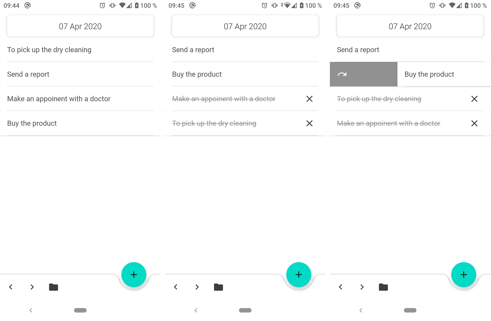
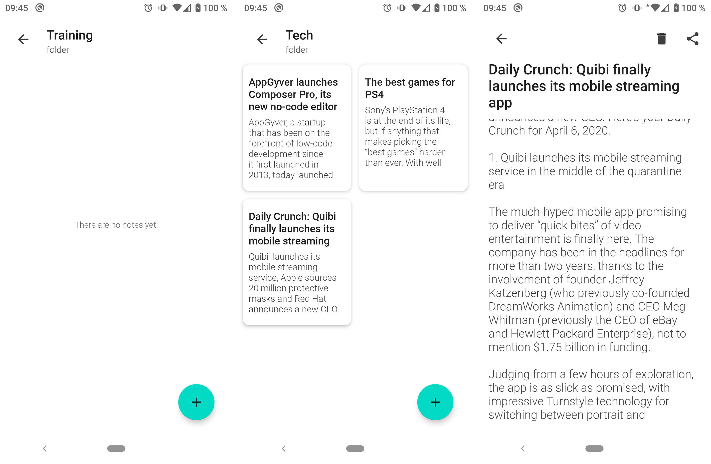
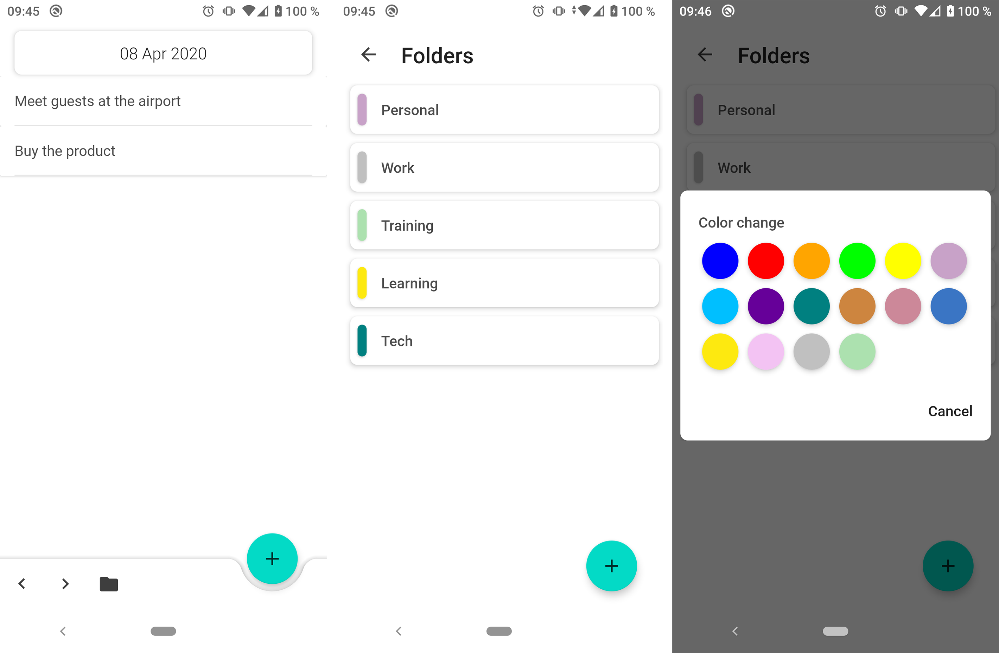

Notes App

===============================================================================================================

Application notebook. The app is very simple and convenient for making a list of things to do for the day.
You can also create folders on topics and create a note with the information you need for yourself and
share them.  
All notes are stored only on your phone, and SQLite is used for storage.

Screen
------
  
  

Contact
-------
tel: +7 (911) 395-34-25  
telegram: [@il_osipov](https://t.me/il_osipov)  
e-mail: il.osipov.gm@gmail.com